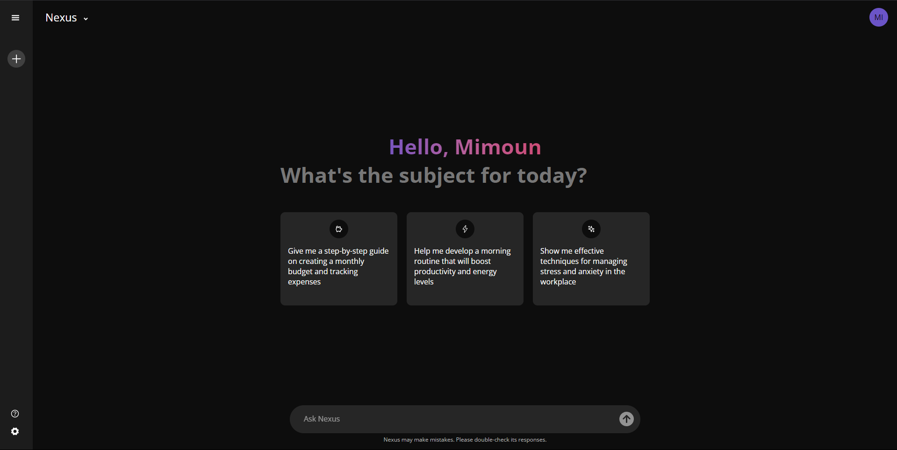

# Nexus 🚀

Nexus is a chat application built with React, designed to showcase what I learned during the Meta Front-End Engineer course certification. This project represents a milestone in my journey to becoming a front-end engineer. At the time of building this, I was only 1.5 months into my learning process.

## 📸 Preview



## Features ✨
- Dynamic chat capabilities.
- Cross-platform support: Fully functional on mobile, tablet, and desktop devices.
- Theme changer: Switch seamlessly between dark and light themes.
- Multi-language support: Available in French, English, and Dutch.
- Integration with advanced AI models.
  - **Nexus**: Powered by `Qwen2-72B-Instruct`.
  - **Nexus Pro**: Powered by `llama3.1-405b`.


## Motivation 💡
The primary goal of this project was to apply the skills I acquired during the Meta certification course, including React development, component structuring, and state management. While the project is far from perfect, it represents an important step in my development as a front-end engineer.

## Future Plans 🔮
- **Restructuring**: As my skills grow, I plan to restructure the project for better maintainability and scalability.
- **Tailwind CSS**: While currently styled using SASS, I intend to transition to Tailwind CSS once I feel more comfortable with it.
- **Version 2**: A cleaner, more polished version of Nexus may be developed when these improvements are implemented.

## Challenges & Vision 🛠️
Originally, I planned to implement image comprehension using the vision capabilities of Llama 3.2 models (11B & 90B). Unfortunately, the lack of proper Llama API documentation for these vision models made this feature infeasible for the initial release. This remains an area of interest for future exploration.

## Design Inspiration 🎨
The app design was heavily inspired by popular chat applications like ChatGPT and Gemini. These apps served as a reference for creating an intuitive and user-friendly interface.

## Acknowledgments 🙏
This project is not a polished final product, and the code reflects my early-stage learning. However, it stands as a testament to the knowledge gained and challenges overcome during this foundational phase of my front-end engineering journey.

## Getting Started 🏁
1. Clone the repository:
   ```bash
   git clone https://github.com/yourusername/nexus.git
   ```
2. Install dependencies:
   ```bash
   npm install
   ```
3. Create the API key file:
   - In the `src/components/api` folder, create a new file named `apiKey.js`.
   - Add the following line of code to the file:
     ```javascript
     export const API_KEY = "API KEY HERE";
     ```
   - You can obtain an API key from [Llama API](https://www.llama-api.com/).
4. Run the application:
   ```bash
   npm start
   ```
